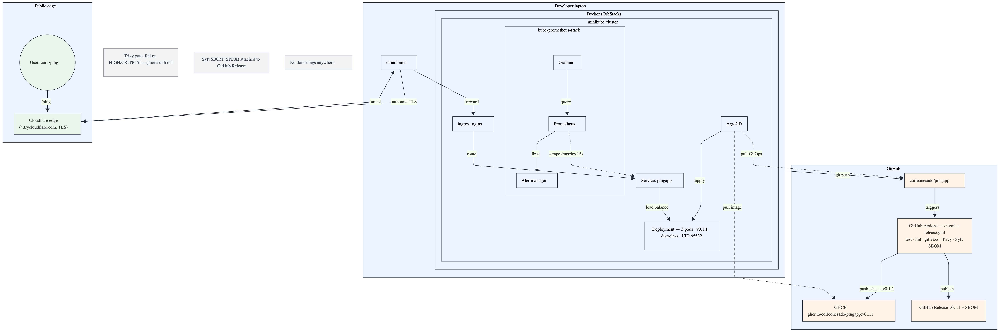

# pingapp

> Insider One DevOps internship case study — **Track B** (local minikube + cloudflared tunnel).

A tiny HTTP service in Go (~14 MB distroless image, runs as UID 65532) shipped end-to-end through Docker, Helm, minikube, GitHub Actions, ArgoCD GitOps, and a Prometheus/Grafana observability stack — exposed via a public Cloudflare quick tunnel. The point is **not** a perfect system; it is a small, reproducible slice with each non-obvious choice captured as an ADR.

The brief lives in [`docs/case-study.pdf`](docs/case-study.pdf).

---

## Endpoints

| Method | Path | Response | Purpose |
|---|---|---|---|
| GET | `/ping` | `pong` (text/plain, 200) | Human / demo endpoint |
| GET | `/healthz` | `OK` (text/plain, 200) | Kubernetes liveness / readiness |
| GET | `/version` | `{"version":"<sha>"}` (application/json) | Build identity, injected at build via `-ldflags` |
| GET | `/metrics` | Prometheus exposition | `http_requests_total{method,path,status}`, `http_request_duration_seconds`, `http_requests_in_flight`, plus Go runtime + process collectors |
| GET | `/chaos` | `500` (off by default) | Synthetic error endpoint for the `PingappHighErrorRate` alert demo. Gated behind `ENABLE_CHAOS=1` / `chaos.enabled` — registers as a 404 otherwise |

Every response carries an `X-Request-ID` header. Incoming `X-Request-ID` headers are honored; otherwise a UUID v4 is generated. The same id is attached to the structured JSON access log line for that request.

---

## Quick start

### Local Go

```bash
make run                 # listens on :8080, version = current git SHA
curl localhost:8080/ping # -> pong
```

### Docker

```bash
make docker-build        # builds pingapp:<sha> and pingapp:dev
make docker-run          # forwards 8080 -> 8080
curl localhost:8080/ping
```

### docker compose

```bash
docker compose up --build -d
curl localhost:8080/ping
docker compose down
```

### Tests

```bash
make test                # go test ./... -race -cover
```

### Fresh-laptop reproducibility

```bash
make bootstrap           # scripts/bootstrap.sh — verifies docker, kubectl, helm,
                         # minikube, go, gh, cloudflared, golangci-lint, trivy, gitleaks
```

---

## Configuration

All config is env-driven; see [`.env.example`](.env.example).

| Var | Default | Notes |
|---|---|---|
| `PORT` | `8080` | HTTP listen port |
| `LOG_LEVEL` | `info` | `debug` / `info` / `warn` / `error` |
| `ENABLE_CHAOS` | `0` | When `1`, registers `GET /chaos` (always 500) — for alert drills only |
| `VERSION` | (build-time) | Injected via `-ldflags "-X main.version=…"`, not read at runtime |

---

## Kubernetes & Helm

The Helm chart lives in [`charts/pingapp/`](charts/pingapp/). One chart, two values files; hand-rolled (not from `helm create`) — rationale in [ADR-0002](docs/decisions/0002-helm-over-raw-manifests.md).

### Deploying

```bash
make minikube-up                                           # start cluster + ingress + metrics-server
make deploy-dev                                            # build, load into minikube, helm upgrade --install -f values-dev.yaml
make status                                                # pods, svc, ingress, rollout status

# reach the app:
curl --resolve dev.pingapp.local:80:$(minikube ip) http://dev.pingapp.local/ping
```

### Dev vs prod

|  | dev (`values-dev.yaml`) | prod (`values-prod.yaml`) |
|---|---|---|
| Replicas | **1** | **2** |
| Ingress host | `dev.pingapp.local` | `pingapp.local` |
| Log level | `debug` | `info` |
| CPU request / limit | 25m / 100m | 50m / 200m |
| Memory request / limit | 16Mi / 32Mi | 32Mi / 64Mi |
| PodDisruptionBudget | disabled (1 replica) | `minAvailable: 1` |
| ServiceMonitor / PrometheusRule | disabled | enabled (`release: kps` label) |
| `/chaos` endpoint | disabled | disabled (enable temporarily via `--set chaos.enabled=true` for alert drills) |

Probes (same in both): liveness on `/healthz` every 10s after a 5s grace; readiness on `/healthz` every 5s after 2s. The container drops all Linux capabilities, runs as UID 65532, and uses a read-only root filesystem with `seccompProfile: RuntimeDefault`.

### Rollout / rollback

```bash
make deploy-dev                                            # revision 1
make deploy-prod                                           # revision 2 — replicas 1 -> 2, dev -> prod host
make history                                               # helm history
make rollback                                              # back to the previous revision
```

Captured evidence under [`docs/screenshots/`](docs/screenshots/) — text logs of `kubectl`, `helm history`, ingress curls, ArgoCD sync, alert fire/resolve, cloudflared tunnel.

---

## CI/CD & supply chain

Two workflows under [`.github/workflows/`](.github/workflows/):

**`ci.yml`** — on PRs and pushes to `main`:

| Job | What |
|---|---|
| `test` | `go test ./... -race -cover` (module + build cache) |
| `lint` | `golangci-lint` v2 (config in `.golangci.yml`) |
| `actionlint` | lints the workflow YAML itself |
| `gitleaks` | secret scan across full history |
| `build & scan` | docker build → **Trivy** (fails on `HIGH/CRITICAL`, `--ignore-unfixed`) → push `:<sha>` to GHCR **(main only)** |

Concurrency cancels stale runs per ref. GHCR push uses the built-in `GITHUB_TOKEN` with `packages: write` — **no PATs**. Only the immutable `:<sha>` tag is pushed; there are **no `:latest` tags** anywhere ([ADR-0004](docs/decisions/0004-image-scanning-gate.md)).

Supply-chain hygiene also includes `.github/dependabot.yml` (weekly bumps for Go modules, GitHub Actions, and the Docker base image).

**`release.yml`** — on a `v*.*.*` tag: build → Trivy scan → push `:<semver>` + `:<sha>` → generate an SPDX **SBOM** with Syft → create a GitHub Release with notes pulled from `CHANGELOG.md` and the SBOM attached.

### Auto-deploy — ArgoCD GitOps

A GitHub-hosted runner can't reach a laptop-local minikube, so deploy is a **pull**: ArgoCD runs inside the cluster and syncs `charts/pingapp` from this repo. Setup and rationale: [`deploy/argocd/`](deploy/argocd/) and [ADR-0003](docs/decisions/0003-auto-deploy-argocd.md).

```bash
make argocd-install                                        # ArgoCD into the argocd namespace
make argocd-app TAG=v0.1.1                                 # Application pointed at the current GHCR image
```

---

## Observability

Stack: **kube-prometheus-stack** on minikube. The chart ships a `ServiceMonitor` (Prometheus scrapes `/metrics` every 15s) and a `PrometheusRule` (alerts on `5xx rate > 5% for 2m`), both gated by values flags.

```bash
make obs-install                                           # helm install kube-prometheus-stack into monitoring
make grafana                                               # port-forward Grafana to http://localhost:3000 (admin/admin)
# import the dashboard:
#   Grafana -> Dashboards -> Import -> upload docs/grafana-dashboard.json
```

Dashboard panels (`docs/grafana-dashboard.json`): RPS by status, latency p50 / p95 / p99, 5xx error rate, in-flight, pod restarts (1h), active alerts.

Alert fire / resolve demonstrated end-to-end against `/chaos`:

- [`06-alert-firing.txt`](docs/screenshots/06-alert-firing.txt) — 5xx ratio 51.6 %, `alertstate=firing`.
- [`07-alert-resolved.txt`](docs/screenshots/07-alert-resolved.txt) — alert resolved 150 s after load stopped.

### Public URL — cloudflared

```bash
make tunnel                                                # prints a fresh https://<random>.trycloudflare.com URL
```

Pull tunnel from the laptop to Cloudflare's edge — no inbound exposure, automatic TLS. Ephemeral by design; rationale in [ADR-0005](docs/decisions/0005-public-url-cloudflared.md). Evidence: [`08-cloudflared-tunnel.txt`](docs/screenshots/08-cloudflared-tunnel.txt).

### Operations

- [`RUNBOOK.md`](RUNBOOK.md) — restart, logs, rollback, PAT rotation, common failures.
- [`SECURITY.md`](SECURITY.md) — threat model, image hardening, supply chain, secrets.
- [`docs/postmortem.md`](docs/postmortem.md) — real incidents during the build and what we did about them.
- [`scripts/bootstrap.sh`](scripts/bootstrap.sh) — fresh-laptop toolchain check.

---

## Architecture



The diagram source lives at [`docs/architecture.png`](docs/architecture.png) (rendered from a Mermaid `flowchart TB` block).

---

## Decisions (ADRs)

| ID | Title |
|---|---|
| [ADR-0001](docs/decisions/0001-language-and-runtime.md) | Language and runtime: Go on distroless |
| [ADR-0002](docs/decisions/0002-helm-over-raw-manifests.md) | Helm over raw manifests / Kustomize |
| [ADR-0003](docs/decisions/0003-auto-deploy-argocd.md) | Auto-deploy via ArgoCD GitOps |
| [ADR-0004](docs/decisions/0004-image-scanning-gate.md) | Image scanning gate — Trivy on HIGH/CRITICAL |
| [ADR-0005](docs/decisions/0005-public-url-cloudflared.md) | Public URL via cloudflared quick tunnel |

---

## Project layout

```
.
├── README.md, CHANGELOG.md, RUNBOOK.md, SECURITY.md, CLAUDE.md
├── Dockerfile, docker-compose.yaml, Makefile, .golangci.yml, .env.example
├── cmd/server/main.go                  # entrypoint
├── internal/
│   ├── handlers/                       # HTTP handlers, middleware, /chaos gating, tests
│   ├── logger/                         # slog setup
│   └── metrics/                        # prom client_golang collectors + middleware
├── charts/pingapp/                     # Helm chart (Deployment, Service, Ingress,
│                                       #   ConfigMap, PDB, ServiceMonitor, PrometheusRule)
├── deploy/argocd/                      # ArgoCD Application + setup notes
├── scripts/bootstrap.sh                # fresh-laptop toolchain check
├── .github/
│   ├── workflows/ci.yml, release.yml
│   ├── dependabot.yml
│   ├── CODEOWNERS, PULL_REQUEST_TEMPLATE.md
└── docs/
    ├── case-study.pdf, architecture.png, grafana-dashboard.json
    ├── postmortem.md
    ├── decisions/                      # ADRs 0001 – 0005
    └── screenshots/                    # evidence logs (kubectl, helm, ArgoCD, alerts, tunnel)
```

---

## AI usage

Per the case study's house rule: this project uses Claude (chat) and Claude Code throughout. Claude Code is used for scaffolding source, writing tests, drafting ADRs, and editing docs; final review and decisions are mine. Significant decisions made with AI input are captured in their respective ADRs.

---

## Submission

Submitted for the Insider One DevOps internship case study, May 2026. Repo is public; the live demo URL is ephemeral — run `make tunnel` immediately before sharing.
